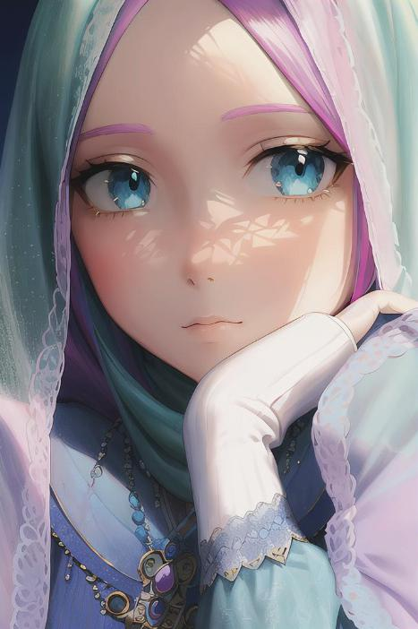

# anime-ai
 Convert selfie image to anime
 
## Usage
```php
use Namdevel\AnimeMaker;
require('src/animeMaker.php');

$source = './tes.jpg';
$animeMaker = new AnimeMaker($source);
$animeMaker->createAnime();
```
## Result
Original                   |  Anime
:-------------------------:|:-------------------------:
  |  

License
------------

This open-source software is distributed under the MIT License. See LICENSE.md

Contributing
------------

All kinds of contributions are welcome - code, tests, documentation, bug reports, new features, etc...

* Send feedbacks.
* Submit bug reports.
* Write/Edit the documents.
* Fix bugs or add new features.
